<div align="center">

[](https://github.com/this-rafael/paketa-credito-challange)

[](https://git.io/typing-svg)

<p>
  <a href="https://github.com/this-rafael/paketa-credito-challange/actions/workflows/ci.yml">
    
  </a>
  <a href="https://this-rafael.github.io/paketa-credito-challange/">
    
  </a>
  <a href="vitest.config.ts">
    
  </a>
  <a href="openapi/openapi.yaml">
    
  </a>
</p>

<p>
  <a href="README.md">🇧🇷 Português</a>
  &nbsp;•&nbsp;
  <a href="#-start-in-60-seconds">Quick start</a>
  &nbsp;•&nbsp;
  <a href="#-the-api-in-one-minute">API</a>
  &nbsp;•&nbsp;
  <a href="#-architecture">Architecture</a>
  &nbsp;•&nbsp;
  <a href="#-living-documentation">Documentation</a>
  &nbsp;•&nbsp;
  <a href="#-evolution-with-tdd">TDD</a>
</p>

<p>
  <a href="https://this-rafael.github.io/paketa-credito-challange/">
    
  </a>
</p>

<p>
  <a href="https://this-rafael.github.io/paketa-credito-challange/">
    <strong>📚 Explore the interactive documentation →</strong>
  </a>
  <br />
  <sub>OpenAPI · TypeDoc · Architecture Explorer — generated from the repository</sub>
</p>

</div>

## ✨ About the project

This HTTP API manages hierarchical corporate menus. It creates root or child
items, delivers the complete nested forest, and consistently deletes an entire
subtree.

The project began as a solution to Paketá's technical challenge and was
developed as a production-grade service: isolated domain rules, explicit
contracts, real persistence, observable failures, navigable documentation, and
measurable quality.

<div align="center">

|                      | What was built                                                                  |
| :------------------: | :------------------------------------------------------------------------------ |
|   🌳 **Hierarchy**   | Arbitrarily deep menu forests with deterministic ordering                       |
|  ⚡ **Performance**  | Two-pass tree assembly — `O(n)` time and memory                                 |
| 🧭 **Architecture**  | Domain, application, HTTP, and infrastructure with inward-pointing dependencies |
|  🛡️ **Resilience**   | Fail-fast validation, typed errors, request IDs, and graceful shutdown          |
|  🧪 **Confidence**   | 18 suites, 111 tests, and 100% coverage across all four metrics                 |
| 📚 **Documentation** | OpenAPI 3.1, TypeDoc, and an interactive code knowledge graph                   |

</div>

<div align="center">
  
</div>

## 🚀 Start in 60 seconds

### With Docker — recommended

```bash
git clone https://github.com/this-rafael/paketa-credito-challange.git
cd paketa-credito-challange
docker compose up --build
```

The API will be available at `http://localhost:3000`, with Swagger documentation
at `http://localhost:3000/docs`.

### With Node.js

Requirements: Node.js 24 LTS and a locally available MongoDB 7 instance.

```bash
npm ci
npm run dev
```

The process opens its HTTP port only after connecting to MongoDB and ensuring
the required indexes.

<div align="center">
  
</div>

## ⚡ The API in one minute

| Method   | Route               | Behavior                                 | Success |
| :------- | :------------------ | :--------------------------------------- | :-----: |
| `POST`   | `/api/v1/menu`      | Creates a root or child item             |  `201`  |
| `GET`    | `/api/v1/menu`      | Returns the complete hierarchical forest |  `200`  |
| `DELETE` | `/api/v1/menu/{id}` | Deletes the item and all its descendants |  `204`  |

### 1. Create a root item

```bash
curl --request POST http://localhost:3000/api/v1/menu \
  --header 'Content-Type: application/json' \
  --data '{"name":"Home appliances"}'
```

```json
{ "id": "1" }
```

### 2. Add a submenu

```bash
curl --request POST http://localhost:3000/api/v1/menu \
  --header 'Content-Type: application/json' \
  --data '{"name":"Televisions","relatedId":1}'
```

### 3. Read the tree

```bash
curl http://localhost:3000/api/v1/menu
```

```json
[
  {
    "id": "1",
    "name": "Home appliances",
    "submenus": [
      {
        "id": "2",
        "name": "Televisions"
      }
    ]
  }
]
```

<details>
<summary><strong>How are errors represented?</strong></summary>
<br />

Every public failure follows the same contract and carries a `requestId` for log
correlation:

```json
{
  "error": {
    "code": "PARENT_MENU_ITEM_NOT_FOUND",
    "message": "Parent menu item not found",
    "requestId": "c5fca0c4-d7c3-43c8-a624-2ab3ec8f0b67"
  }
}
```

The contract covers malformed JSON, validation, unsafe IDs, missing parents or
items, duplicate names, oversized payloads, unsupported media types, database
unavailability, and internal failures.

</details>

> [!TIP]
> Explore schemas, examples, and every response in the
> [OpenAPI reference](https://this-rafael.github.io/paketa-credito-challange/openapi/)
> or the [local Swagger UI](http://localhost:3000/docs).

<div align="center">
  
</div>

## 🏗️ Architecture

The design keeps business rules independent from Express, Mongoose, and
operational details. External implementations satisfy ports defined by the
application layer.

<details>
<summary><strong>Architectural decisions — why this structure?</strong></summary>
<br />

Although the challenge has only three endpoints, the implementation was structured
to show how a small API can remain testable, predictable, and evolvable without
coupling business rules to the HTTP framework or the database.

The goal was not to reproduce the full complexity of an enterprise system, but to
apply architectural boundaries only where they solve concrete problems.

#### Separation of domain, application, and infrastructure

Menu-related rules do not depend directly on Express, Mongoose, or MongoDB.

This separation allows:

* testing use cases without starting a server or database;
* replacing persistence details without changing business rules;
* preventing framework specifics from leaking into the application;
* keeping controllers responsible only for the HTTP protocol.

The main flow is:

```text
HTTP → Controller → Use Case → Repository Port → MongoDB Adapter
```

#### Explicit use cases

Each API operation is represented by a specific use case:

* item creation;
* item deletion;
* full tree retrieval.

This split avoids generic services with multiple responsibilities and makes each
operation's rules easier to locate, test, and change.

#### Repository as a port

Use cases depend on a repository contract, not directly on Mongoose.

This decision enables unit tests with in-memory implementations and keeps details
such as schemas, queries, and MongoDB operators confined to the infrastructure
layer.

The abstraction was not created to anticipate multiple databases, but to prevent
application logic from depending on the persistence technology.

#### Public identifier separate from ObjectId

MongoDB uses `ObjectId` internally, but the challenge contract works with numeric
identifiers and the `relatedId` field.

Therefore, the application keeps a numeric public identifier separate from
MongoDB's internal identifier.

This decision:

* preserves the external contract;
* avoids exposing database details;
* keeps references between items consistent;
* allows changing persistence without modifying the API.

#### Atomic identifier generation

Identifier generation uses an atomic MongoDB operation.

Computing the next identifier from the current maximum value could produce
collisions when two requests are processed concurrently.

The atomic counter ensures each creation receives a unique identifier even under
concurrency.

#### Hierarchical representation via adjacency list

Each item stores only a reference to its parent.

This representation was chosen because it:

* simplifies item creation;
* allows arbitrary depth;
* avoids duplicating the entire tree in every document;
* keeps changes local and predictable;
* maps directly to the `relatedId` field defined by the challenge.

#### In-memory tree construction

The query loads all items in a single operation and builds the tree using maps
indexed by identifier.

This process is O(n) and avoids:

* one database query per level;
* recursive persistence access;
* N+1 behavior;
* aggregation pipelines tightly coupled to MongoDB.

Tree assembly remains a pure domain function, enabling tests independent of
infrastructure.

#### Subtree deletion

When an item is deleted, its descendants must also be removed to avoid orphaned
records.

The model keeps enough information to identify the subtree without relying on
multiple recursive queries in the application.

This decision preserves hierarchical integrity and makes the deletion semantics
explicit.

#### Typed errors

Domain and application errors are represented by dedicated types, such as:

* missing parent item;
* item not found;
* duplicate name;
* hierarchical inconsistency.

The controller does not interpret MongoDB internal codes or know details such as
duplicate-index errors. Infrastructure converts technical failures into errors
understood by the application, and the HTTP layer maps those errors to appropriate
status codes.

#### Validation at the edge

Data received by the API is validated before reaching the use cases.

HTTP validation guarantees format and basic types. Use cases remain responsible
for business rules, such as parent existence and name uniqueness.

This separation avoids mixing transport validation with domain validation.

#### Explicit dependency composition

Dependencies are instantiated in the application's main composition layer.

Controllers and use cases do not create repositories, models, or connections
directly. This makes the dependency graph visible and avoids service locators or
hidden dependencies.

#### Testing strategy

The number of tests is not tied to the number of endpoints, but to the behaviors
and risks involved.

The suite is split by purpose:

* unit tests for domain rules and use cases;
* integration tests for MongoDB adapters;
* HTTP tests for API contract validation;
* concurrency tests for identifier generation;
* architecture tests to preserve layer boundaries;
* documentation tests to keep OpenAPI aligned with the implementation.

Each test level protects a different responsibility. The goal is not to test the
same implementation multiple times, but to catch failures at the level closest to
their origin.

#### Quality gates

Linting, type checking, tests, and documentation validation run automatically.

These checks prevent seemingly small changes from introducing:

* typing errors;
* architectural boundary violations;
* divergence between code and OpenAPI;
* HTTP contract regressions;
* MongoDB integration failures.

#### Trade-offs

This architecture has more files and concepts than an implementation based only on
routes, controllers, and models.

The accepted cost is a larger initial structure. In return, the solution offers:

* rules isolated from frameworks;
* faster, more focused tests;
* explicit dependencies;
* lower coupling to MongoDB;
* predictable error handling;
* greater safety for evolution.

For a throwaway API, this structure would likely be unnecessary. For this
challenge, it was adopted deliberately to demonstrate code organization,
concurrency, testability, data integrity, and evolvability.

#### What was not abstracted

The architecture does not try to abstract every detail or anticipate nonexistent
requirements.

No generalizations were created for multiple databases, multiple protocols, or
features outside the challenge.

Existing abstractions correspond to real boundaries:

* HTTP entry;
* use case execution;
* persistence;
* identifier generation;
* hierarchy assembly.

The goal is to keep structural complexity justifiable, not to maximize the number
of patterns used.

```mermaid
flowchart LR
    Client([HTTP Client])

    subgraph HTTP["HTTP / API"]
      MW[Middlewares]
      Routes[Routes + Zod]
      Controller[MenuController]
    end

    subgraph App["Application"]
      Create[CreateMenuItem]
      Get[GetMenuTree]
      Delete[DeleteMenuSubtree]
      Ports{{Ports}}
    end

    subgraph Domain["Domain"]
      Entity[MenuItem]
      Errors[Typed errors]
    end

    subgraph Infra["Infrastructure"]
      Repository[MongooseMenuRepository]
      Ids[MongoIdGenerator]
      Mongo[(MongoDB)]
    end

    Client --> MW --> Routes --> Controller
    Controller --> Create
    Controller --> Get
    Controller --> Delete
    Create --> Entity
    Create --> Ports
    Get --> Ports
    Get --> Tree[buildMenuTree O&#40;n&#41;]
    Delete --> Ports
    Entity --> Errors
    Repository -. implements .-> Ports
    Ids -. implements .-> Ports
    Repository --> Mongo
    Ids --> Mongo
```

</details>



### Main flows

<details>
<summary><strong>Item creation</strong></summary>
<br />

1. Zod validates `name` and the optional `relatedId`.
2. The use case looks up the parent when required.
3. The domain normalizes the name and blocks invalid IDs or cycles.
4. A MongoDB counter generates the sequential ID atomically.
5. The repository persists the item and converts index conflicts into a domain error.

</details>

<details>
<summary><strong>Tree retrieval</strong></summary>
<br />

Items arrive as an ordered flat list. `buildMenuTree` first creates an ID-indexed
`Map`, then connects each node to its parent. This avoids nested searches,
preserves ordering, and reports orphaned nodes as data-integrity failures.

</details>

<details>
<summary><strong>Subtree deletion</strong></summary>
<br />

Each document keeps its ancestor chain. The repository can therefore remove the
selected root and every document that references it in `ancestors` without a
recursive application-level traversal.

</details>

### Code map

```text
src/
├── domain/          # entities, invariants, and business errors
├── application/     # use cases and ports
├── http/            # controllers, routes, schemas, and middlewares
├── infrastructure/  # MongoDB, Mongoose, configuration, and logging
├── main/            # composition and process lifecycle
└── shared/          # linear tree assembly
```

> [!NOTE]
> The complete graph contains 136 nodes, 338 relationships, 10 layers, and a
> twelve-step guided tour. Open the
> [Architecture Explorer](https://this-rafael.github.io/paketa-credito-challange/architecture/)
> to navigate its dependencies.

<div align="center">
  
</div>

## 🧰 Stack

<div align="center">

### Runtime and API


### Data and operations


### Quality and documentation


</div>

## 🔧 Configuration

| Variable          | Description               | Default                          |
| :---------------- | :------------------------ | :------------------------------- |
| `PORT`            | HTTP port                 | `3000`                           |
| `MONGODB_URI`     | MongoDB connection string | `mongodb://127.0.0.1:27017/menu` |
| `LOG_LEVEL`       | Pino log level            | `info`                           |
| `JSON_BODY_LIMIT` | Maximum JSON body size    | `100kb`                          |

Invalid values stop startup before the process opens its HTTP port.

## 📚 Living documentation

<div align="center">

|           Source           | Purpose                                            | Access                                                                                                   |
| :------------------------: | :------------------------------------------------- | :------------------------------------------------------------------------------------------------------- |
|     📜 **OpenAPI 3.1**     | HTTP contract, schemas, responses, and examples    | [Portal](https://this-rafael.github.io/paketa-credito-challange/openapi/) · [YAML](openapi/openapi.yaml) |
|       🔎 **TypeDoc**       | Types, functions, classes, ports, and use cases    | [Reference](https://this-rafael.github.io/paketa-credito-challange/reference/)                           |
| 🕸️ **Understand Anything** | Layers, dependencies, relationships, and code tour | [Interactive graph](https://this-rafael.github.io/paketa-credito-challange/architecture/)                |

</div>

```bash
npm run docs        # TypeDoc HTML reference in docs/
npm run docs:md     # TypeDoc Markdown reference in docs-md/
npm run docs:all    # both formats
npm run docs:check  # fails on warnings or invalid TSDoc links
npm run docs:site   # assembles the complete portal in _site/
```

The source uses TSDoc validated by ESLint. See
[`TSDOC_STYLE.md`](TSDOC_STYLE.md) for its conventions.

## 🧪 Proven quality

```text
Test Files   18 passed (18)
Tests        111 passed (111)
Statements   100% (259/259)
Branches     100% (168/168)
Functions    100% (52/52)
Lines        100% (258/258)
```

<div align="center">
  
</div>

The test scenarios are based on [`BDD.md`](BDD.md). The suites cover the
domain, use cases, tree assembly, schemas, middlewares, OpenAPI contract,
architecture, process lifecycle, concurrency, and real MongoDB persistence
through Testcontainers.

```bash
npm test                 # tests
npm run coverage         # tests + coverage
npm run typecheck        # TypeScript without emission
npm run lint             # ESLint + TSDoc
npm run format:check     # Prettier
npm run openapi:lint     # Spectral
npm run audit            # production dependencies
npm run benchmark        # 1k, 10k, and 100k nodes
```

<details>
<summary><strong>Local 100,000-node benchmark result</strong></summary>
<br />

On Node.js `v24.18.0`, building a 100,000-node chain took approximately `55 ms`
on this machine. This is a local reference, not an SLA; the algorithm's
guaranteed property is its linear complexity.

</details>

The main workflow runs formatting, lint, type checking, tests, TypeDoc,
Spectral, and the dependency audit on every pull request. The portal has a
separate workflow and is deployed only from `main`.

## 🔴🟢 Evolution with TDD

The solution was built in **red → green** cycles: failing tests first, then
the implementation until green. The history below preserves that sequence in
Git.

| # | Capability | Red | Green |
| :-: | :--- | :--- | :--- |
| 01 | Bootstrap (Express + Vitest) | [`d114801`](https://github.com/this-rafael/paketa-credito-challange/commit/d114801) | [`#1`](https://github.com/this-rafael/paketa-credito-challange/pull/1) |
| 02 | Create menu item | [`e6b0297`](https://github.com/this-rafael/paketa-credito-challange/commit/e6b0297) | [`#2`](https://github.com/this-rafael/paketa-credito-challange/pull/2) |
| 03 | Get menu tree | [`129e1e1`](https://github.com/this-rafael/paketa-credito-challange/commit/129e1e1) | [`#3`](https://github.com/this-rafael/paketa-credito-challange/pull/3) |
| 04 | Delete subtree | [`4f1743b`](https://github.com/this-rafael/paketa-credito-challange/commit/4f1743b) | [`#4`](https://github.com/this-rafael/paketa-credito-challange/pull/4) |
| 05 | Errors and observability | [`5d0571d`](https://github.com/this-rafael/paketa-credito-challange/commit/5d0571d) | [`#5`](https://github.com/this-rafael/paketa-credito-challange/pull/5) |
| 06 | Ops and concurrency | [`53ed9e3`](https://github.com/this-rafael/paketa-credito-challange/commit/53ed9e3) | [`#6`](https://github.com/this-rafael/paketa-credito-challange/pull/6) |
| 07 | OpenAPI and quality gates | [`97323c1`](https://github.com/this-rafael/paketa-credito-challange/commit/97323c1) | [`#7`](https://github.com/this-rafael/paketa-credito-challange/pull/7) |

The `feature/*/red` and `feature/*/green` branches remain in the repository so
each cycle can be inspected.

<div align="center">
  
</div>

## 👨‍💻 Author

<div align="center">

### Rafael Pereira

Senior Software Engineer · Full Stack & Solutions Architect

[](https://github.com/this-rafael)
[](https://www.linkedin.com/in/this-rafael-pereira/)

Built as an independent solution to the
[Paketá Crédito technical challenge](https://github.com/paketacredito/entrevista-tecnica).

[](https://github.com/this-rafael)

</div>
