<div align="center">

[](https://github.com/this-rafael/paketa-credito-challange)

[](https://git.io/typing-svg)

<p>
  <a href="https://github.com/this-rafael/paketa-credito-challange/actions/workflows/ci.yml">
    
  </a>
  <a href="https://this-rafael.github.io/paketa-credito-challange/">
    
  </a>
  <a href="vitest.config.ts">
    
  </a>
  <a href="openapi/openapi.yaml">
    
  </a>
</p>

<p>
  <a href="README.en.md">🇺🇸 English</a>
  &nbsp;•&nbsp;
  <a href="#-comece-em-60-segundos">Quick start</a>
  &nbsp;•&nbsp;
  <a href="#-api-em-um-minuto">API</a>
  &nbsp;•&nbsp;
  <a href="#-arquitetura">Arquitetura</a>
  &nbsp;•&nbsp;
  <a href="#-documentação-viva">Documentação</a>
  &nbsp;•&nbsp;
  <a href="#-evolução-com-tdd">TDD</a>
</p>

<p>
  <a href="https://this-rafael.github.io/paketa-credito-challange/">
    
  </a>
</p>

<p>
  <a href="https://this-rafael.github.io/paketa-credito-challange/">
    <strong>📚 Veja a documentação interativa →</strong>
  </a>
  <br />
  <sub>OpenAPI · TypeDoc · Architecture Explorer — gerados a partir do repositório</sub>
</p>

</div>

## ✨ Sobre o projeto

Esta é uma API HTTP para gerenciar menus corporativos hierárquicos. Ela cria
itens raiz ou filhos, entrega a floresta completa já aninhada e remove uma
subárvore inteira de forma consistente.

O projeto nasceu como solução para o desafio técnico da Paketá e foi tratado
como um serviço de produção: regras de domínio isoladas, contratos explícitos,
persistência real, falhas observáveis, documentação navegável e qualidade
mensurável.

<div align="center">

|                     | O que foi construído                                                             |
| :-----------------: | :------------------------------------------------------------------------------- |
|  🌳 **Hierarquia**  | Floresta de menus de profundidade arbitrária, com ordenação determinística       |
|  ⚡ **Desempenho**  | Montagem da árvore em duas passagens — tempo e memória `O(n)`                    |
| 🧭 **Arquitetura**  | Domínio, aplicação, HTTP e infraestrutura com dependências apontando para dentro |
| 🛡️ **Resiliência**  | Validação fail-fast, erros tipados, request ID e graceful shutdown               |
|  🧪 **Confiança**   | 18 suites, 111 testes e 100% de cobertura nas quatro métricas                    |
| 📚 **Documentação** | OpenAPI 3.1, TypeDoc e grafo interativo do código                                |

</div>

<div align="center">
  
</div>

## 🚀 Comece em 60 segundos

### Com Docker — caminho recomendado

```bash
git clone https://github.com/this-rafael/paketa-credito-challange.git
cd paketa-credito-challange
docker compose up --build
```

A API estará em `http://localhost:3000` e a documentação Swagger em
`http://localhost:3000/docs`.

### Com Node.js

Requisitos: Node.js 24 LTS e MongoDB 7 disponível localmente.

```bash
npm ci
npm run dev
```

O processo só abre a porta HTTP depois de conectar ao MongoDB e garantir os
índices necessários.

<div align="center">
  
</div>

## ⚡ API em um minuto

| Método   | Rota                | Comportamento                              | Sucesso |
| :------- | :------------------ | :----------------------------------------- | :-----: |
| `POST`   | `/api/v1/menu`      | Cria um item raiz ou filho                 |  `201`  |
| `GET`    | `/api/v1/menu`      | Retorna toda a floresta hierárquica        |  `200`  |
| `DELETE` | `/api/v1/menu/{id}` | Remove o item e todos os seus descendentes |  `204`  |

### 1. Crie uma raiz

```bash
curl --request POST http://localhost:3000/api/v1/menu \
  --header 'Content-Type: application/json' \
  --data '{"name":"Eletrodomésticos"}'
```

```json
{ "id": "1" }
```

### 2. Adicione um submenu

```bash
curl --request POST http://localhost:3000/api/v1/menu \
  --header 'Content-Type: application/json' \
  --data '{"name":"Televisores","relatedId":1}'
```

### 3. Consulte a árvore

```bash
curl http://localhost:3000/api/v1/menu
```

```json
[
  {
    "id": "1",
    "name": "Eletrodomésticos",
    "submenus": [
      {
        "id": "2",
        "name": "Televisores"
      }
    ]
  }
]
```

<details>
<summary><strong>Como os erros são apresentados?</strong></summary>
<br />

Toda falha pública segue o mesmo contrato e carrega um `requestId` para
correlação com os logs:

```json
{
  "error": {
    "code": "PARENT_MENU_ITEM_NOT_FOUND",
    "message": "Parent menu item not found",
    "requestId": "c5fca0c4-d7c3-43c8-a624-2ab3ec8f0b67"
  }
}
```

O contrato cobre JSON inválido, validação, ID inseguro, pai ou item ausente,
nome duplicado, payload excessivo, mídia não suportada, indisponibilidade do
banco e falhas internas.

</details>

> [!TIP]
> Explore schemas, exemplos e todas as respostas na
> [referência OpenAPI](https://this-rafael.github.io/paketa-credito-challange/openapi/)
> ou no [Swagger local](http://localhost:3000/docs).

<div align="center">
  
</div>

## 🏗️ Arquitetura

O desenho mantém as regras de negócio independentes de Express, Mongoose e
detalhes operacionais. As implementações externas satisfazem portas definidas
pela aplicação.

<details>
<summary><strong>Decisões arquiteturais — por que essa estrutura?</strong></summary>
<br />

Embora o desafio possua apenas três endpoints, a implementação foi estruturada para
demonstrar como uma API pequena pode permanecer testável, previsível e evolutiva
sem acoplar regras de negócio ao framework HTTP ou ao banco de dados.

A intenção não foi reproduzir toda a complexidade de um sistema corporativo, mas
aplicar fronteiras arquiteturais apenas nos pontos em que elas resolvem problemas
concretos.

#### Separação entre domínio, aplicação e infraestrutura

As regras relacionadas ao menu não dependem diretamente de Express, Mongoose ou
MongoDB.

Essa separação permite:

* testar os casos de uso sem iniciar servidor ou banco;
* substituir detalhes de persistência sem alterar regras de negócio;
* impedir que particularidades do framework contaminem a aplicação;
* manter controllers responsáveis apenas pelo protocolo HTTP.

O fluxo principal é:

```text
HTTP → Controller → Use Case → Repository Port → MongoDB Adapter
```

#### Casos de uso explícitos

Cada operação da API é representada por um caso de uso específico:

* criação de item;
* exclusão de item;
* consulta da árvore completa.

Essa divisão evita services genéricos com múltiplas responsabilidades e torna as
regras de cada operação mais fáceis de localizar, testar e modificar.

#### Repository como porta

Os casos de uso dependem de um contrato de repositório, e não diretamente do
Mongoose.

Essa decisão permite executar testes unitários com implementações em memória e
mantém detalhes como schemas, queries e operadores MongoDB restritos à camada de
infraestrutura.

A abstração não foi criada para prever vários bancos de dados, mas para impedir
que a lógica da aplicação dependa da tecnologia de persistência.

#### Identificador público separado do ObjectId

O MongoDB utiliza `ObjectId` internamente, mas o contrato do desafio trabalha com
identificadores numéricos e com o campo `relatedId`.

Por isso, a aplicação mantém um identificador público numérico separado do
identificador interno do MongoDB.

Essa decisão:

* preserva o contrato externo;
* evita expor detalhes do banco;
* mantém referências entre itens consistentes;
* permite alterar a persistência sem modificar a API.

#### Geração atômica de identificadores

A geração dos identificadores utiliza uma operação atômica no MongoDB.

Calcular o próximo identificador com base no maior valor existente poderia gerar
colisões quando duas requisições fossem processadas simultaneamente.

O contador atômico garante que cada criação receba um identificador único mesmo
sob concorrência.

#### Representação hierárquica por lista de adjacência

Cada item armazena apenas a referência para seu item pai.

Essa representação foi escolhida porque:

* simplifica a criação de itens;
* permite profundidade arbitrária;
* evita duplicar toda a árvore em cada documento;
* mantém alterações locais e previsíveis;
* representa diretamente o campo `relatedId` definido pelo desafio.

#### Construção da árvore em memória

A consulta busca os itens em uma única operação e monta a árvore utilizando mapas
indexados por identificador.

Esse processo possui complexidade O(n), evitando:

* uma consulta ao banco para cada nível;
* recursão de acesso à persistência;
* comportamento N+1;
* pipelines de agregação excessivamente acoplados ao MongoDB.

A montagem da árvore permanece uma função de domínio pura, permitindo testes
independentes da infraestrutura.

#### Exclusão de subárvore

Ao excluir um item, seus descendentes também precisam ser removidos para evitar
registros órfãos.

A modelagem mantém informações suficientes para identificar a subárvore sem
depender de múltiplas consultas recursivas na aplicação.

Essa decisão preserva a integridade hierárquica e torna explícita a semântica da
exclusão.

#### Erros tipados

Erros de domínio e aplicação são representados por tipos próprios, como:

* item pai inexistente;
* item não encontrado;
* nome duplicado;
* inconsistência hierárquica.

O controller não interpreta códigos internos do MongoDB nem conhece detalhes como
erros de índice duplicado. A infraestrutura converte falhas técnicas para erros
compreendidos pela aplicação, e a camada HTTP converte esses erros para status
adequados.

#### Validação na borda

Dados recebidos pela API são validados antes de alcançar os casos de uso.

A validação HTTP garante formato e tipos básicos. Os casos de uso continuam
responsáveis pelas regras de negócio, como existência do item pai e unicidade do
nome.

Essa separação evita misturar validação de transporte com validação de domínio.

#### Composição explícita de dependências

As dependências são instanciadas na camada principal da aplicação.

Controllers e casos de uso não criam diretamente repositories, models ou
conexões. Isso torna o grafo de dependências visível e evita service locators ou
dependências ocultas.

#### Estratégia de testes

A quantidade de testes não está relacionada à quantidade de endpoints, mas aos
comportamentos e riscos existentes.

A suíte foi dividida por objetivo:

* testes unitários para regras de domínio e casos de uso;
* testes de integração para adapters MongoDB;
* testes HTTP para validação do contrato da API;
* testes de concorrência para geração de identificadores;
* testes de arquitetura para preservar as fronteiras entre camadas;
* testes de documentação para manter o OpenAPI compatível com a implementação.

Cada nível de teste protege uma responsabilidade diferente. O objetivo não é
testar a mesma implementação várias vezes, mas detectar falhas no nível mais
próximo de sua origem.

#### Quality gates

Lint, type checking, testes e validação da documentação são executados
automaticamente.

Essas verificações impedem que alterações aparentemente pequenas introduzam:

* erros de tipagem;
* violações das fronteiras arquiteturais;
* divergências entre código e OpenAPI;
* regressões no contrato HTTP;
* falhas de integração com MongoDB.

#### Trade-offs

Essa arquitetura possui mais arquivos e conceitos do que uma implementação baseada
apenas em routes, controllers e models.

O custo aceito é uma estrutura inicial maior. Em contrapartida, a solução oferece:

* regras isoladas de frameworks;
* testes mais rápidos e específicos;
* dependências explícitas;
* menor acoplamento ao MongoDB;
* tratamento previsível de erros;
* maior segurança para evolução.

Para uma API descartável, essa estrutura provavelmente seria desnecessária. Para
este desafio, ela foi adotada deliberadamente para demonstrar organização de
código, concorrência, testabilidade, integridade de dados e capacidade de
evolução.

#### O que não foi abstraído

A arquitetura não busca abstrair todos os detalhes ou antecipar requisitos
inexistentes.

Não foram criadas generalizações para múltiplos bancos, múltiplos protocolos ou
funcionalidades que não fazem parte do desafio.

As abstrações existentes correspondem a fronteiras reais:

* entrada HTTP;
* execução dos casos de uso;
* persistência;
* geração de identificadores;
* montagem da hierarquia.

O objetivo é manter complexidade estrutural justificável, e não maximizar a
quantidade de padrões utilizados.

```mermaid
flowchart LR
    Client([Cliente HTTP])

    subgraph HTTP["HTTP / API"]
      MW[Middlewares]
      Routes[Rotas + Zod]
      Controller[MenuController]
    end

    subgraph App["Aplicação"]
      Create[CreateMenuItem]
      Get[GetMenuTree]
      Delete[DeleteMenuSubtree]
      Ports{{Ports}}
    end

    subgraph Domain["Domínio"]
      Entity[MenuItem]
      Errors[Erros tipados]
    end

    subgraph Infra["Infraestrutura"]
      Repository[MongooseMenuRepository]
      Ids[MongoIdGenerator]
      Mongo[(MongoDB)]
    end

    Client --> MW --> Routes --> Controller
    Controller --> Create
    Controller --> Get
    Controller --> Delete
    Create --> Entity
    Create --> Ports
    Get --> Ports
    Get --> Tree[buildMenuTree O&#40;n&#41;]
    Delete --> Ports
    Entity --> Errors
    Repository -. implementa .-> Ports
    Ids -. implementa .-> Ports
    Repository --> Mongo
    Ids --> Mongo
```

</details>



### Fluxos principais

<details>
<summary><strong>Criação de item</strong></summary>
<br />

1. Zod valida `name` e o `relatedId` opcional.
2. O caso de uso busca o pai quando necessário.
3. O domínio normaliza o nome e impede IDs inválidos ou ciclos.
4. Um contador MongoDB gera o ID sequencial de forma atômica.
5. O repositório persiste e converte conflitos de índice em erro de domínio.

</details>

<details>
<summary><strong>Leitura da árvore</strong></summary>
<br />

Os itens chegam ordenados como uma lista plana. `buildMenuTree` primeiro cria
um índice `Map` por ID e depois conecta cada nó ao pai. A estratégia evita
buscas aninhadas, preserva a ordem e detecta órfãos como falha de integridade.

</details>

<details>
<summary><strong>Exclusão de subárvore</strong></summary>
<br />

Cada documento mantém sua cadeia de ancestrais. Assim, o repositório remove a
raiz selecionada e todos os documentos que a referenciam em `ancestors`, sem
percorrer recursivamente a árvore pela aplicação.

</details>

### Mapa do código

```text
src/
├── domain/          # entidades, invariantes e erros de negócio
├── application/     # casos de uso e portas
├── http/            # controllers, rotas, schemas e middlewares
├── infrastructure/  # MongoDB, Mongoose, configuração e logging
├── main/            # composição e ciclo de vida do processo
└── shared/          # construção linear da árvore
```

> [!NOTE]
> O grafo completo contém 136 nós, 338 relações, 10 camadas e um tour guiado
> em 12 etapas. Abra o
> [Architecture Explorer](https://this-rafael.github.io/paketa-credito-challange/architecture/)
> para navegar pelas dependências.

<div align="center">
  
</div>

## 🧰 Stack

<div align="center">

### Runtime e API


### Dados e operação


### Qualidade e documentação


</div>

## 🔧 Configuração

| Variável          | Descrição                    | Padrão                           |
| :---------------- | :--------------------------- | :------------------------------- |
| `PORT`            | Porta HTTP                   | `3000`                           |
| `MONGODB_URI`     | String de conexão do MongoDB | `mongodb://127.0.0.1:27017/menu` |
| `LOG_LEVEL`       | Nível de log do Pino         | `info`                           |
| `JSON_BODY_LIMIT` | Limite máximo do corpo JSON  | `100kb`                          |

Valores inválidos interrompem o startup antes da abertura da porta HTTP.

## 📚 Documentação viva

<div align="center">

|           Fonte            | Para que serve                                   | Acesso                                                                                                   |
| :------------------------: | :----------------------------------------------- | :------------------------------------------------------------------------------------------------------- |
|     📜 **OpenAPI 3.1**     | Contrato HTTP, schemas, respostas e exemplos     | [Portal](https://this-rafael.github.io/paketa-credito-challange/openapi/) · [YAML](openapi/openapi.yaml) |
|       🔎 **TypeDoc**       | Tipos, funções, classes, ports e casos de uso    | [Referência](https://this-rafael.github.io/paketa-credito-challange/reference/)                          |
| 🕸️ **Understand Anything** | Camadas, dependências, relações e tour do código | [Grafo interativo](https://this-rafael.github.io/paketa-credito-challange/architecture/)                 |

</div>

```bash
npm run docs        # referência TypeDoc HTML em docs/
npm run docs:md     # referência TypeDoc Markdown em docs-md/
npm run docs:all    # ambos os formatos
npm run docs:check  # falha para warnings ou links TSDoc inválidos
npm run docs:site   # monta o portal completo em _site/
```

O código usa TSDoc validado pelo ESLint. Consulte
[`TSDOC_STYLE.md`](TSDOC_STYLE.md) para as convenções.

## 🧪 Qualidade comprovada

```text
Test Files   18 passed (18)
Tests        111 passed (111)
Statements   100% (259/259)
Branches     100% (168/168)
Functions    100% (52/52)
Lines        100% (258/258)
```

<div align="center">
  
</div>

Os cenários de teste se baseiam no documento [`BDD.md`](BDD.md). As suites
cobrem domínio, casos de uso, árvore, schemas, middlewares, contrato OpenAPI,
arquitetura, ciclo de vida, concorrência e persistência real com MongoDB via
Testcontainers.

```bash
npm test                 # testes
npm run coverage         # testes + cobertura
npm run typecheck        # TypeScript sem emissão
npm run lint             # ESLint + TSDoc
npm run format:check     # Prettier
npm run openapi:lint     # Spectral
npm run audit            # dependências de produção
npm run benchmark        # 1k, 10k e 100k nós
```

<details>
<summary><strong>Resultado local do benchmark de 100 mil nós</strong></summary>
<br />

Em Node.js `v24.18.0`, a construção de uma cadeia de 100 mil nós levou
aproximadamente `55 ms` nesta máquina. O número é uma referência local, não um
SLA; o atributo garantido pelo algoritmo é sua complexidade linear.

</details>

O workflow principal executa formatação, lint, typecheck, testes, TypeDoc,
Spectral e auditoria a cada pull request. O portal possui um workflow separado
e só é publicado a partir da `main`.

## 🔴🟢 Evolução com TDD

A solução foi construída em ciclos **red → green**: primeiro os testes
falhando, depois a implementação até o verde. O histórico abaixo preserva
essa sequência no Git.

| # | Capacidade | Red | Green |
| :-: | :--- | :--- | :--- |
| 01 | Bootstrap (Express + Vitest) | [`d114801`](https://github.com/this-rafael/paketa-credito-challange/commit/d114801) | [`#1`](https://github.com/this-rafael/paketa-credito-challange/pull/1) |
| 02 | Criar item de menu | [`e6b0297`](https://github.com/this-rafael/paketa-credito-challange/commit/e6b0297) | [`#2`](https://github.com/this-rafael/paketa-credito-challange/pull/2) |
| 03 | Obter árvore de menus | [`129e1e1`](https://github.com/this-rafael/paketa-credito-challange/commit/129e1e1) | [`#3`](https://github.com/this-rafael/paketa-credito-challange/pull/3) |
| 04 | Remover subárvore | [`4f1743b`](https://github.com/this-rafael/paketa-credito-challange/commit/4f1743b) | [`#4`](https://github.com/this-rafael/paketa-credito-challange/pull/4) |
| 05 | Erros e observabilidade | [`5d0571d`](https://github.com/this-rafael/paketa-credito-challange/commit/5d0571d) | [`#5`](https://github.com/this-rafael/paketa-credito-challange/pull/5) |
| 06 | Ops e concorrência | [`53ed9e3`](https://github.com/this-rafael/paketa-credito-challange/commit/53ed9e3) | [`#6`](https://github.com/this-rafael/paketa-credito-challange/pull/6) |
| 07 | OpenAPI e quality gates | [`97323c1`](https://github.com/this-rafael/paketa-credito-challange/commit/97323c1) | [`#7`](https://github.com/this-rafael/paketa-credito-challange/pull/7) |

As branches `feature/*/red` e `feature/*/green` permanecem no repositório para
inspecionar cada ciclo.

<div align="center">
  
</div>

## 👨‍💻 Autor

<div align="center">

### Rafael Pereira

Engenheiro de Software Sênior · Full Stack & Solutions Architect

[](https://github.com/this-rafael)
[](https://www.linkedin.com/in/this-rafael-pereira/)

Construído como solução independente para o desafio técnico da
[Paketá Crédito](https://github.com/paketacredito/entrevista-tecnica).

[](https://github.com/this-rafael)

</div>
