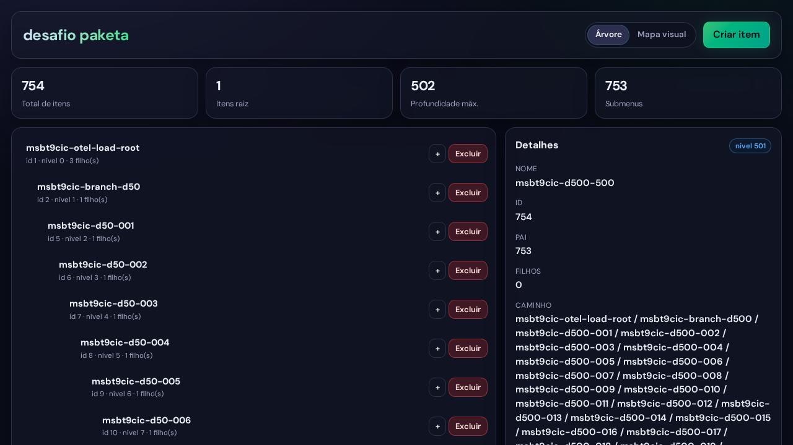
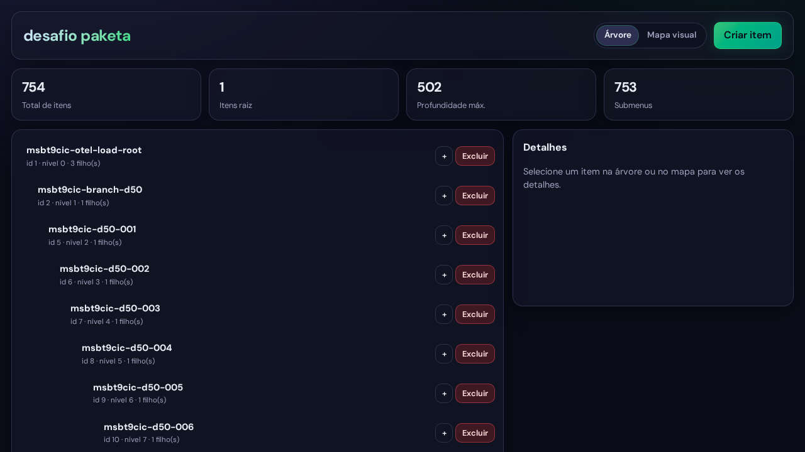
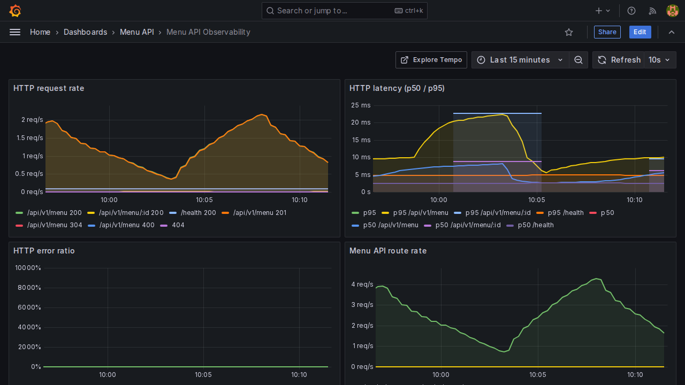
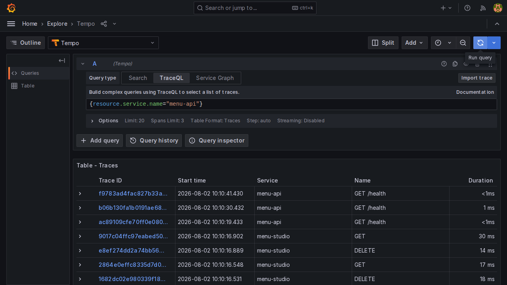
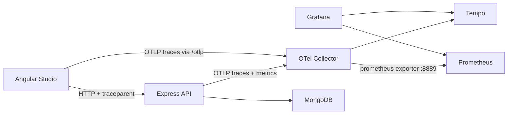

# Paketa / Base39 — Menu challenge (OpenTelemetry experiment)

- **backend/** — Menu API (Express + MongoDB) instrumented with OpenTelemetry. Docs: [backend/README.md](backend/README.md)
- **frontend/** — Menu Studio (Angular) with browser tracing. Docs: [frontend/README.md](frontend/README.md)
- **observability/** — OTel Collector, Tempo, Prometheus, Grafana provisioning

*Essa branch foi implementada após o envio do projeto — pode desconsiderá-la, mas caso tenha curiosidade ela contém o equivalente a este projeto instrumentado com OpenTelemetry.*

## Quick start (full stack + observability)

```bash
docker compose up --build
```

| Service | URL |
|---------|-----|
| UI | http://localhost:4200 |
| API | http://localhost:3000 |
| Health | http://localhost:3000/health |
| Swagger | http://localhost:3000/docs |
| Grafana | http://localhost:3001 (`admin` / `admin`) |
| Prometheus | http://localhost:9090 |
| Tempo | http://localhost:3200 |
| OTLP (Collector) | http://localhost:4318 |

The `web` container proxies `/api` → API and `/otlp` → Collector (browser traces without CORS pain).

## What this experiment adds

- **Collector-first pipeline**: API and UI export OTLP to the Collector; Collector fans out to Tempo (traces) and a Prometheus scrape endpoint (metrics). The API does **not** open a side-car Prometheus port.
- **Clean-architecture placement**: SDK lives under `backend/src/infrastructure/telemetry/`, registered via `node --import` before Express/Mongoose load.
- **Log ↔ trace correlation**: Pino mixes `trace_id` / `span_id` (and HTTP logs keep `requestId`).
- **Domain spans**: `menu.create`, `menu.get_tree`, `menu.delete_subtree` plus auto HTTP/Mongo spans; errors mark the active span.
- **Frontend tracing**: Angular Studio propagates W3C `traceparent` on API calls.
- **Pinned images** and Grafana on **:3001** so it never collides with the API on **:3000**.
- **`OTEL_ENABLED`**: off under Vitest by default so the existing BDD suites stay hermetic.

### Evidence (load via Menu Studio)

UI-driven load (no API seed) builds one root with three linear branches — depths **50 / 200 / 500** (~754 creates with unique timestamp-prefixed names) — then reloads the Studio tree and deletes the three branch heads (subtree wipe). Playwright then captures Grafana + Tempo.

Reproduce:

```bash
docker compose up --build
npm ci --prefix e2e && npx --prefix e2e playwright install chromium
npm run evidence:otel
```

**Studio**





**Grafana / Tempo** (`menu-api-otel`, last 15m)






**Analysis:** The Studio load produces a clear create-heavy series on Prometheus (`service_name="menu-api"`), with `/api/v1/menu` **201** dominating the HTTP request-rate panel (~2 req/s peak) and 4xx ratio at ~0%. Latency stays healthy (p50 ≈ 5–10ms, p95 ≈ 10–20ms) under ~750 sequential UI creates. Tempo Explore with TraceQL `{resource.service.name="menu-api"}` lists traces spanning `menu-api` and `menu-studio` (including GET/DELETE from the reload and branch subtree deletes) — evidence that Collector → Prometheus/Tempo works end-to-end for this experiment.



## Local development

```bash
docker compose up -d mongodb tempo otel-collector prometheus grafana
npm run install:all
OTEL_EXPORTER_OTLP_ENDPOINT=http://127.0.0.1:4318 npm run dev:backend
npm run dev:frontend   # proxies /api and /otlp
```

Environment knobs (API):

| Variable | Default | Description |
| --- | --- | --- |
| `OTEL_ENABLED` | `true` (false under Vitest) | Master switch |
| `OTEL_SERVICE_NAME` | `menu-api` | Resource `service.name` |
| `OTEL_EXPORTER_OTLP_ENDPOINT` | `http://127.0.0.1:4318` | Collector base URL (no `/v1/...` suffix) |

## Inspecting telemetry

1. Generate traffic from the UI or `curl` against `/api/v1/menu`.
2. Open Grafana → folder **Menu API** → dashboard **Menu API Observability**.
3. Explore → datasource **Tempo** → search by service `menu-api` or `menu-studio`.
4. Correlate a log line’s `trace_id` with the Tempo trace.

## Without Docker UI

```bash
docker compose up mongodb api otel-collector tempo prometheus grafana
npm run install:all
npm run dev:frontend
```
