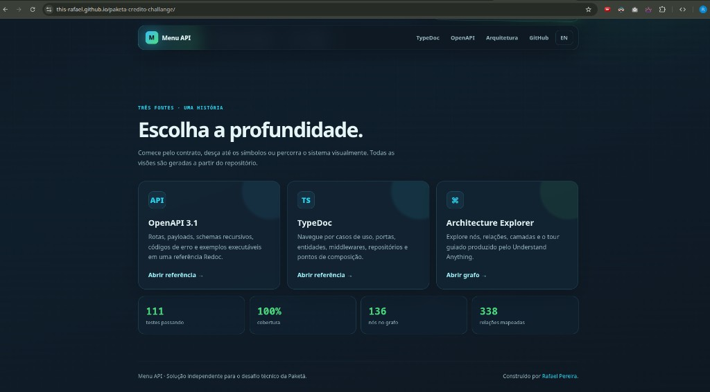
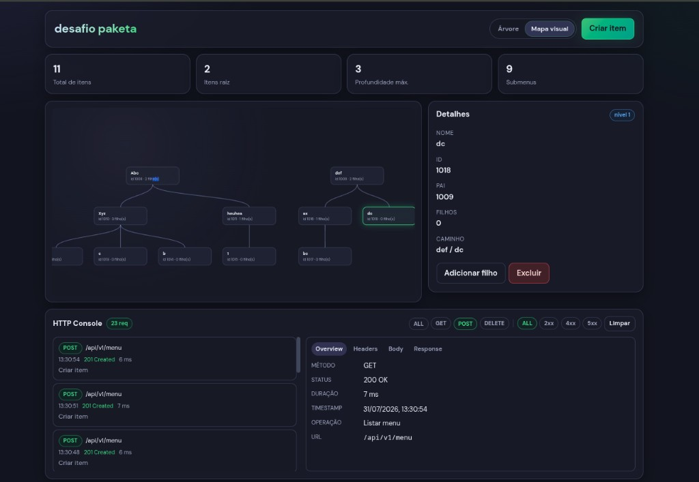
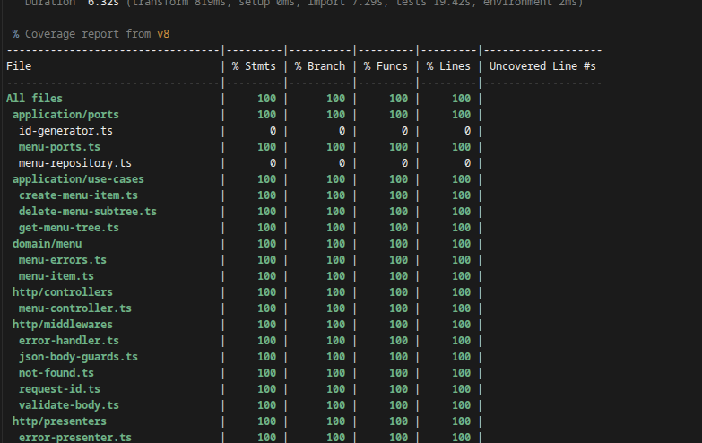

<div align="center">

[](https://github.com/this-rafael/paketa-credito-challange)

[](https://git.io/typing-svg)

<p>
  <a href="https://github.com/this-rafael/paketa-credito-challange/actions/workflows/ci.yml">
    
  </a>
  <a href="https://this-rafael.github.io/paketa-credito-challange/">
    
  </a>
  <a href="vitest.config.ts">
    
  </a>
  <a href="openapi/openapi.yaml">
    
  </a>
</p>

<p>
  <a href="README.en.md">🇺🇸 English</a>
  &nbsp;•&nbsp;
  <a href="#-comece-em-60-segundos">Quick start</a>
  &nbsp;•&nbsp;
  <a href="#-api-em-um-minuto">API</a>
  &nbsp;•&nbsp;
  <a href="#-arquitetura">Arquitetura</a>
  &nbsp;•&nbsp;
  <a href="#-documentação-viva">Documentação</a>
  &nbsp;•&nbsp;
  <a href="#-evolução-com-tdd">TDD</a>
</p>

<p>
  <a href="https://this-rafael.github.io/paketa-credito-challange/">
    
  </a>
</p>

<p>
  <a href="https://this-rafael.github.io/paketa-credito-challange/">
    <strong>📚 Veja a documentação interativa →</strong>
  </a>
  <br />
  <sub>OpenAPI · TypeDoc · Architecture Explorer: gerados a partir do repositório</sub>
</p>

</div>

## ✨ Sobre o projeto

Esta é uma API HTTP para gerenciar menus corporativos hierárquicos. Ela cria
itens raiz ou filhos, entrega a floresta completa já aninhada e remove uma
subárvore inteira de forma consistente.

O projeto nasceu como solução para o desafio técnico da Paketá e foi tratado
como um serviço de produção: regras de domínio isoladas, contratos explícitos,
persistência real, falhas observáveis, documentação navegável e qualidade
mensurável.

<div align="center">

|                     | O que foi construído                                                             |
| :-----------------: | :------------------------------------------------------------------------------- |
|  🌳 **Hierarquia**  | Floresta de menus de profundidade arbitrária, com ordenação determinística       |
|  ⚡ **Desempenho**  | Montagem da árvore em duas passagens: tempo e memória `O(n)`                     |
| 🧭 **Arquitetura**  | Domínio, aplicação, HTTP e infraestrutura com dependências apontando para dentro |
| 🛡️ **Resiliência**  | Validação fail-fast, erros tipados, request ID e graceful shutdown               |
|  🧪 **Confiança**   | 18 suites, 111 testes e 100% de cobertura nas quatro métricas                    |
| 📚 **Documentação** | OpenAPI 3.1, TypeDoc e grafo interativo do código                                |

</div>

<div align="center">
  
</div>

## 🎛️ Addon opcional: UI para explorar a árvore

A entrega principal é a API. Se, na avaliação, for mais confortável *ver* a
hierarquia sendo montada e desmontada — em vez de só bater no Swagger ou no
`curl` — existe um studio Angular na branch
[`experiments/angular`](https://github.com/this-rafael/paketa-credito-challange/tree/experiments/angular).

É um extra: mapa/árvore, detalhes do nó, criar/excluir e um console HTTP ao vivo.
Não altera o contrato nem a arquitetura da API em `main`.

<div align="center">
  <a href="https://github.com/this-rafael/paketa-credito-challange/tree/experiments/angular">
    
  </a>
  <p>
    <sub>
      Branch
      <a href="https://github.com/this-rafael/paketa-credito-challange/tree/experiments/angular"><code>experiments/angular</code></a>
      · <code>docker compose up --build</code> · UI em <code>http://localhost:4200</code>
    </sub>
  </p>
</div>

## 📡 Addon opcional: OpenTelemetry

*Essa branch foi implementada após o envio do projeto — pode desconsiderá-la, mas caso tenha curiosidade ela contém o equivalente a este projeto instrumentado com OpenTelemetry.*

Se quiser inspecionar traces, métricas e correlação com logs estruturados, a branch
[`experiments/opentelemetry`](https://github.com/this-rafael/paketa-credito-challange/tree/experiments/opentelemetry)
estende o monorepo (API + Studio) com Collector → Tempo/Prometheus + Grafana,
spans de domínio (`menu.create` / `menu.get_tree` / `menu.delete_subtree`) e
propagação W3C a partir do Angular. Não altera o contrato nem a arquitetura da
API em `main`.

<p>
  <sub>
    Branch
    <a href="https://github.com/this-rafael/paketa-credito-challange/tree/experiments/opentelemetry"><code>experiments/opentelemetry</code></a>
    · <code>docker compose up --build</code>
    · Grafana em <code>http://localhost:3001</code> (<code>admin</code>/<code>admin</code>)
  </sub>
</p>

## 🚀 Comece em 60 segundos

### Com Docker: caminho recomendado

```bash
git clone https://github.com/this-rafael/paketa-credito-challange.git
cd paketa-credito-challange
docker compose up --build
```

A API estará em `http://localhost:3000` e a documentação Swagger em
`http://localhost:3000/docs`.

### Com Node.js

Requisitos: Node.js 24 LTS e MongoDB 7 disponível localmente.

```bash
npm ci
npm run dev
```

O processo só abre a porta HTTP depois de conectar ao MongoDB e garantir os
índices necessários.

<div align="center">
  
</div>

## ⚡ API em um minuto

| Método   | Rota                | Comportamento                              | Sucesso |
| :------- | :------------------ | :----------------------------------------- | :-----: |
| `POST`   | `/api/v1/menu`      | Cria um item raiz ou filho                 |  `201`  |
| `GET`    | `/api/v1/menu`      | Retorna toda a floresta hierárquica        |  `200`  |
| `DELETE` | `/api/v1/menu/{id}` | Remove o item e todos os seus descendentes |  `204`  |

### 1. Crie uma raiz

```bash
curl --request POST http://localhost:3000/api/v1/menu \
  --header 'Content-Type: application/json' \
  --data '{"name":"Eletrodomésticos"}'
```

```json
{ "id": "1" }
```

### 2. Adicione um submenu

```bash
curl --request POST http://localhost:3000/api/v1/menu \
  --header 'Content-Type: application/json' \
  --data '{"name":"Televisores","relatedId":1}'
```

### 3. Consulte a árvore

```bash
curl http://localhost:3000/api/v1/menu
```

```json
[
  {
    "id": "1",
    "name": "Eletrodomésticos",
    "submenus": [
      {
        "id": "2",
        "name": "Televisores"
      }
    ]
  }
]
```

<details>
<summary><strong>Como os erros são apresentados?</strong></summary>
<br />

Toda falha pública segue o mesmo contrato e carrega um `requestId` para
correlação com os logs:

```json
{
  "error": {
    "code": "PARENT_MENU_ITEM_NOT_FOUND",
    "message": "Parent menu item not found",
    "requestId": "c5fca0c4-d7c3-43c8-a624-2ab3ec8f0b67"
  }
}
```

O contrato cobre JSON inválido, validação, ID inseguro, pai ou item ausente,
nome duplicado, payload excessivo, mídia não suportada, indisponibilidade do
banco e falhas internas.

</details>

> [!TIP]
> Explore schemas, exemplos e todas as respostas na
> [referência OpenAPI](https://this-rafael.github.io/paketa-credito-challange/openapi/)
> ou no [Swagger local](http://localhost:3000/docs).

<div align="center">
  
</div>

## 🏗️ Arquitetura

O desenho mantém as regras de negócio independentes de Express, Mongoose e
detalhes operacionais. As implementações externas satisfazem portas definidas
pela aplicação.

<details>
<summary><strong>Decisões arquiteturais: por que essa estrutura?</strong></summary>
<br />

São só três endpoints. A estrutura existe para manter regras testáveis e
desacopladas de Express/MongoDB, não para simular um sistema corporativo completo.
As fronteiras aparecem só onde resolvem um problema concreto.

#### Domínio, aplicação e infraestrutura

Regras de menu não importam Express, Mongoose nem MongoDB. Isso permite:

* testar casos de uso sem servidor ou banco;
* trocar persistência sem mexer nas regras;
* deixar controllers só no protocolo HTTP.

```text
HTTP → Controller → Use Case → Repository Port → MongoDB Adapter
```

#### Um caso de uso por operação

Criação, exclusão e consulta da árvore têm casos de uso próprios. Evita um
"service" genérico e deixa cada regra fácil de achar e testar.

#### Repository como porta

Casos de uso dependem de um contrato, não do Mongoose. Schemas, queries e
operadores ficam na infraestrutura; testes unitários usam fakes em memória.

A porta não antecipa "vários bancos". Ela impede a aplicação de depender da
tecnologia de persistência.

#### ID público ≠ ObjectId

O desafio exige IDs numéricos e `relatedId`. O MongoDB continua com `ObjectId`
por baixo; a API expõe só o ID numérico. O contrato externo não vaza detalhe do
banco.

#### Contador atômico

`max(id) + 1` colide sob concorrência. Um contador atômico no MongoDB garante ID
único em criações paralelas.

#### Lista de adjacência

Cada item guarda só o pai (`relatedId`). Criação fica simples, a profundidade é
arbitrária e não há cópia da árvore inteira em cada documento.

#### Árvore em memória, O(n)

Um `find` traz a lista plana; mapas por ID montam a floresta em tempo linear.
Sem query por nível, sem N+1 e sem aggregation pipeline amarrada ao MongoDB. A
função de montagem é pura e testável sem infraestrutura.

#### Exclusão de subárvore

Apagar um item remove os descendentes. A cadeia de `ancestors` no documento
permite achar a subárvore sem recursão de queries na aplicação.

#### Erros tipados

Pai inexistente, item ausente, nome duplicado, hierarquia inconsistente: tipos
próprios. A infra traduz falhas técnicas (ex.: índice único); o HTTP só mapeia
esses erros para status.

#### Validação na borda

Zod cobre formato e tipos na entrada. Existência do pai e unicidade do nome
ficam no caso de uso.

#### Composição explícita

`main` instancia repositories, generators e casos de uso. Nada de service
locator nem `new` escondido dentro de controller.

#### Testes por risco, não por endpoint

* unitário: domínio e casos de uso;
* integração: adapters MongoDB;
* HTTP: contrato da API;
* concorrência: geração de IDs;
* arquitetura: fronteiras entre camadas;
* documentação: OpenAPI alinhado ao código.

Cada camada pega a falha perto da origem.

#### Quality gates

Lint, types, testes e checagem de docs no CI. Evitam regressão de tipagem,
fronteiras, OpenAPI, contrato HTTP e MongoDB.

#### Trade-offs

Mais arquivos e conceitos do que routes + controllers + models. O custo é
estrutura inicial maior; o ganho é regras isoladas, testes focados, dependências
visíveis e erros previsíveis.

Para uma API descartável, seria excesso. Neste desafio, a escolha é deliberada:
mostrar organização, concorrência, testabilidade e integridade da hierarquia.

#### O que não foi abstraído

Sem multi-banco, multi-protocolo ou features fora do escopo. As únicas portas
são as fronteiras reais: HTTP, casos de uso, persistência, IDs e montagem da
árvore. Complexidade só onde se justifica.

</details>


### Fluxos principais

<details>
<summary><strong>Criação de item</strong></summary>
<br />

1. Zod valida `name` e o `relatedId` opcional.
2. O caso de uso busca o pai quando necessário.
3. O domínio normaliza o nome e impede IDs inválidos ou ciclos.
4. Um contador MongoDB gera o ID sequencial de forma atômica.
5. O repositório persiste e converte conflitos de índice em erro de domínio.

</details>

<details>
<summary><strong>Leitura da árvore</strong></summary>
<br />

Os itens chegam ordenados como uma lista plana. `buildMenuTree` primeiro cria
um índice `Map` por ID e depois conecta cada nó ao pai. A estratégia evita
buscas aninhadas, preserva a ordem e detecta órfãos como falha de integridade.

</details>

<details>
<summary><strong>Exclusão de subárvore</strong></summary>
<br />

Cada documento mantém sua cadeia de ancestrais. Assim, o repositório remove a
raiz selecionada e todos os documentos que a referenciam em `ancestors`, sem
percorrer recursivamente a árvore pela aplicação.

</details>

### Mapa do código

```text
src/
├── domain/          # entidades, invariantes e erros de negócio
├── application/     # casos de uso e portas
├── http/            # controllers, rotas, schemas e middlewares
├── infrastructure/  # MongoDB, Mongoose, configuração e logging
├── main/            # composição e ciclo de vida do processo
└── shared/          # construção linear da árvore
```

> [!NOTE]
> O grafo completo contém 136 nós, 338 relações, 10 camadas e um tour guiado
> em 12 etapas. Abra o
> [Architecture Explorer](https://this-rafael.github.io/paketa-credito-challange/architecture/)
> para navegar pelas dependências.

<div align="center">
  
</div>

## 🧰 Stack

<div align="center">

### Runtime e API


### Dados e operação


### Qualidade e documentação


</div>

## 🔧 Configuração

| Variável          | Descrição                    | Padrão                           |
| :---------------- | :--------------------------- | :------------------------------- |
| `PORT`            | Porta HTTP                   | `3000`                           |
| `MONGODB_URI`     | String de conexão do MongoDB | `mongodb://127.0.0.1:27017/menu` |
| `LOG_LEVEL`       | Nível de log do Pino         | `info`                           |
| `JSON_BODY_LIMIT` | Limite máximo do corpo JSON  | `100kb`                          |

Valores inválidos interrompem o startup antes da abertura da porta HTTP.

## 📚 Documentação viva

<div align="center">

|           Fonte            | Para que serve                                   | Acesso                                                                                                   |
| :------------------------: | :----------------------------------------------- | :------------------------------------------------------------------------------------------------------- |
|     📜 **OpenAPI 3.1**     | Contrato HTTP, schemas, respostas e exemplos     | [Portal](https://this-rafael.github.io/paketa-credito-challange/openapi/) · [YAML](openapi/openapi.yaml) |
|       🔎 **TypeDoc**       | Tipos, funções, classes, ports e casos de uso    | [Referência](https://this-rafael.github.io/paketa-credito-challange/reference/)                          |
| 🕸️ **Understand Anything** | Camadas, dependências, relações e tour do código | [Grafo interativo](https://this-rafael.github.io/paketa-credito-challange/architecture/)                 |

</div>

```bash
npm run docs        # referência TypeDoc HTML em docs/
npm run docs:md     # referência TypeDoc Markdown em docs-md/
npm run docs:all    # ambos os formatos
npm run docs:check  # falha para warnings ou links TSDoc inválidos
npm run docs:site   # monta o portal completo em _site/
```

O código usa TSDoc validado pelo ESLint. Consulte
[`TSDOC_STYLE.md`](TSDOC_STYLE.md) para as convenções.

## 🧪 Qualidade comprovada

```text
Test Files   18 passed (18)
Tests        111 passed (111)
Statements   100% (259/259)
Branches     100% (168/168)
Functions    100% (52/52)
Lines        100% (258/258)
```

<div align="center">
  
</div>

Os cenários de teste se baseiam no documento [`BDD.md`](BDD.md). As suites
cobrem domínio, casos de uso, árvore, schemas, middlewares, contrato OpenAPI,
arquitetura, ciclo de vida, concorrência e persistência real com MongoDB via
Testcontainers.

```bash
npm test                 # testes
npm run coverage         # testes + cobertura
npm run typecheck        # TypeScript sem emissão
npm run lint             # ESLint + TSDoc
npm run format:check     # Prettier
npm run openapi:lint     # Spectral
npm run audit            # dependências de produção
npm run benchmark        # 1k, 10k e 100k nós
```

<details>
<summary><strong>Resultado local do benchmark de 100 mil nós</strong></summary>
<br />

Em Node.js `v24.18.0`, a construção de uma cadeia de 100 mil nós levou
aproximadamente `55 ms` nesta máquina. O número é uma referência local, não um
SLA; o atributo garantido pelo algoritmo é sua complexidade linear.

</details>

O workflow principal executa formatação, lint, typecheck, testes, TypeDoc,
Spectral e auditoria a cada pull request. O portal possui um workflow separado
e só é publicado a partir da `main`.

## 🔴🟢 Evolução com TDD

A solução foi construída em ciclos **red → green**: primeiro os testes
falhando, depois a implementação até o verde. O histórico abaixo preserva
essa sequência no Git.

| # | Capacidade | Red | Green |
| :-: | :--- | :--- | :--- |
| 01 | Bootstrap (Express + Vitest) | [`d114801`](https://github.com/this-rafael/paketa-credito-challange/commit/d114801) | [`#1`](https://github.com/this-rafael/paketa-credito-challange/pull/1) |
| 02 | Criar item de menu | [`e6b0297`](https://github.com/this-rafael/paketa-credito-challange/commit/e6b0297) | [`#2`](https://github.com/this-rafael/paketa-credito-challange/pull/2) |
| 03 | Obter árvore de menus | [`129e1e1`](https://github.com/this-rafael/paketa-credito-challange/commit/129e1e1) | [`#3`](https://github.com/this-rafael/paketa-credito-challange/pull/3) |
| 04 | Remover subárvore | [`4f1743b`](https://github.com/this-rafael/paketa-credito-challange/commit/4f1743b) | [`#4`](https://github.com/this-rafael/paketa-credito-challange/pull/4) |
| 05 | Erros e observabilidade | [`5d0571d`](https://github.com/this-rafael/paketa-credito-challange/commit/5d0571d) | [`#5`](https://github.com/this-rafael/paketa-credito-challange/pull/5) |
| 06 | Ops e concorrência | [`53ed9e3`](https://github.com/this-rafael/paketa-credito-challange/commit/53ed9e3) | [`#6`](https://github.com/this-rafael/paketa-credito-challange/pull/6) |
| 07 | OpenAPI e quality gates | [`97323c1`](https://github.com/this-rafael/paketa-credito-challange/commit/97323c1) | [`#7`](https://github.com/this-rafael/paketa-credito-challange/pull/7) |

As branches `feature/*/red` e `feature/*/green` permanecem no repositório para
inspecionar cada ciclo.

<div align="center">
  
</div>

## 👨‍💻 Autor

<div align="center">

### Rafael Pereira

Engenheiro de Software Sênior · Full Stack & Solutions Architect

[](https://github.com/this-rafael)
[](https://www.linkedin.com/in/this-rafael-pereira/)

Construído como solução independente para o desafio técnico da
[Paketá Crédito](https://github.com/paketacredito/entrevista-tecnica).

[](https://github.com/this-rafael)

</div>
